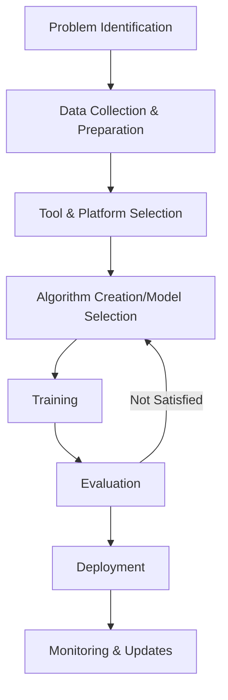

# Comprehensive Guide to AI System Development

## Introduction
Building an AI system requires several key components working in harmony. This guide provides a structured approach to AI development, from initial planning to deployment and maintenance.

## Overview of AI Development Process

## Step 1: Problem Identification & Goal Definition
- **Define clear, measurable goals** for your AI system
- Consider:
  - **Feasibility**: Can AI effectively address this issue?
  - **Impact**: What benefit will solving this problem bring?
  - **Data availability**: Do you have quality data related to this problem?

## Step 2: Data Collection & Preparation
- **Gather relevant, high-quality datasets** (internal databases, purchased data, open datasets)
- **Clean your data** using tools like Python's Pandas or R's dplyr
  - Handle missing values
  - Remove inconsistencies
  - Deal with outliers
- Ensure:
  - **Data privacy** compliance with regulations
  - **Relevance** to your defined problem
  - Appropriate **volume** (more isn't always better)

## Step 3: Tool & Platform Selection
- Choose between **cloud-based platforms** (AWS, Google Cloud) and **local servers**
- Select programming languages:
  - **Python**: Popular for extensive library support
  - **R**: Favored for statistical computations
  - **Java**: For enterprise-scale applications
  - **C++**: When speed is crucial
- Consider:
  - **Scalability**: Can your platform handle growth?
  - **Cost-effectiveness**: Does the price match your budget?
  - **Compatibility**: Integration with existing systems

## Step 4: Algorithm Creation/Model Selection
- Options depend on problem complexity, data volume, and team expertise:
  - **Create algorithms from scratch**: Requires programming proficiency
  - **Select pre-existing models**: Tools like TensorFlow or PyTorch offer pre-trained models
- Consider:
  - **Computational resources** required
  - **Accuracy vs. speed** trade-offs
  - **Interpretability** of the model's decision-making

### Types of Learning Algorithms
- **Supervised learning**: Uses labeled data (classification, regression)
- **Unsupervised learning**: Finds patterns in unlabeled data (clustering, dimensionality reduction)
- **Reinforcement learning**: Trains through reward signals (games, robotics, decision-making)

### Neural Network Architectures
- **Basic neural networks**: Input layer, hidden layers, and output layer
- **Convolutional Neural Networks (CNNs)**: Excellent for image processing
- **Recurrent Neural Networks (RNNs)**: Ideal for sequential data like text
- **Transformer models**: State-of-the-art for NLP tasks

## Step 5: Training the Model
- Split data into **training and validation sets**
- Use frameworks like **TensorFlow, PyTorch, or Keras**
- Consider:
  - **Quality of data**: Ensure clean and relevant training data
  - **Overfitting vs. underfitting**: Balance model complexity
  - **Computational resources**: Training can be resource-intensive
- Implement:
  - **Batch processing**: Train on subsets of data
  - **Hyperparameter tuning**: Optimize model parameters
  - **Regularization techniques**: Prevent overfitting

### Optimization Techniques
- **Hyperparameter optimization**: Grid search, random search, Bayesian methods
- **Feature engineering**: Create meaningful features from raw data
- **Regularization**: L1/L2 penalties to prevent overfitting
- **Ensemble methods**: Combine multiple models for better performance
- **Gradient descent variants**: Adam, RMSprop, SGD with momentum

## Step 6: Evaluation
- Use techniques like:
  - **Cross-validation**
  - **Precision-recall curves**
  - **Receiver Operating Characteristic (ROC) curves**
  - **Confusion matrices**
- Address:
  - **Overfitting/underfitting**
  - **Model bias**
  - **Real-world applicability**
- Tools: TensorFlow, Scikit-Learn

### Performance Metrics
- Classification: accuracy, precision, recall, F1-score
- Regression: mean squared error, mean absolute error, R-squared
- Ranking: normalized discounted cumulative gain (NDCG), mean average precision
- Time series: forecasting error metrics (MAE, RMSE, MAPE)

## Step 7: Deployment
- Options include:
  - **APIs** for system interoperability
  - **User interfaces** for end-user interaction
  - **Containerization** with Docker and Kubernetes
- Consider:
  - **Compatibility** with existing systems
  - **Scalability** for increased load
  - **Security** measures for data protection
  - **Monitoring** mechanisms to track performance

### Deployment Strategies
- **Cloud platforms**: Easy scalability and management
- **On-premises**: More control, suitable for sensitive data
- **Container technologies**: Consistent deployment across environments
- **Edge deployment**: For devices with limited connectivity
- **Serverless**: Automatic scaling with cloud functions

## Step 8: Monitoring & Regular Updates
- Track performance using tools like **TensorBoard** or **Cloud Monitoring**
- Watch for:
  - **Changing data patterns** that may require retraining
  - **Continued relevance** to business goals
  - **Maintenance needs** as technologies advance

### Maintenance Best Practices
- Regular performance monitoring
- Data quality maintenance
- Scheduled model retraining
- Security patching
- Comprehensive testing with new data

## Specialized AI Applications

### Natural Language Processing (NLP)
- Enables AI to understand and generate human language
- Used in chatbots, translation, text analysis
- Techniques include:
  - Tokenization
  - Word embeddings
  - Sentiment analysis
  - Named entity recognition
  - Large language models (e.g., GPT)

### Computer Vision
- Allows AI to interpret visual information
- Applications: facial recognition, object detection, image classification
- Key techniques:
  - Convolutional Neural Networks
  - Image segmentation
  - Feature extraction
  - Transfer learning with pre-trained models

### Speech Recognition
- Converts spoken language to text
- Used in voice assistants, transcription services
- Techniques:
  - Hidden Markov Models
  - Deep Neural Networks
  - Recurrent Neural Networks
  - Acoustic and language modeling

## Common Challenges and Solutions

### Data Quality Issues
- **Missing values**: Use imputation techniques or remove incomplete data
- **Outliers**: Identify and handle extreme values
- **Inconsistencies**: Standardize formats and correct errors
- **Small datasets**: Apply data augmentation or transfer learning

### Overfitting
- **Symptoms**: Good training performance but poor validation results
- **Solutions**:
  - Add more training data
  - Use regularization techniques
  - Implement dropout layers
  - Simplify model architecture
  - Early stopping during training

### Computational Resources
- **Problem**: Training large models requires significant computing power
- **Solutions**:
  - Utilize GPUs or TPUs for accelerated training
  - Consider cloud-based computing solutions
  - Optimize model architecture for efficiency
  - Use quantization to reduce model size
  - Implement distributed training across multiple machines

### Ethical Considerations
- **Bias**: Test for and mitigate algorithmic bias
- **Privacy**: Implement data protection measures
- **Transparency**: Work toward explainable AI
- **Accountability**: Establish clear responsibility for AI decisions

## Future Trends in AI Development

### Emerging Technologies
- **Large language models**: Growing capability and efficiency
- **Multimodal AI**: Combining text, vision, and audio understanding
- **Artificial general intelligence**: Progress toward human-level intelligence
- **Self-supervised learning**: Reducing reliance on labeled data

### Ethical and Societal Impacts
- **Transparency in AI decision-making**
- **Bias mitigation in models**
- **Workforce transformation** and potential job displacement
- **Regulatory and governance frameworks**

## Resource Directory

### Libraries and Frameworks
- **TensorFlow**: Comprehensive ML platform
- **PyTorch**: Dynamic deep learning
- **Scikit-learn**: Classical ML algorithms
- **Keras**: High-level neural networks API
- **FastAI**: Simplified deep learning

### Learning Resources
- **Online courses**: Coursera, Udacity, edX
- **Documentation**: Framework-specific guides
- **Books**: "Deep Learning" by Goodfellow et al., "Hands-On Machine Learning" by Géron
- **Research papers**: ArXiv for latest advancements

### Communities
- **GitHub**: Code repositories and collaborations
- **Stack Overflow**: Coding questions and answers
- **Reddit**: r/MachineLearning for discussions
- **Conferences**: NeurIPS, ICML, ICLR for networking
